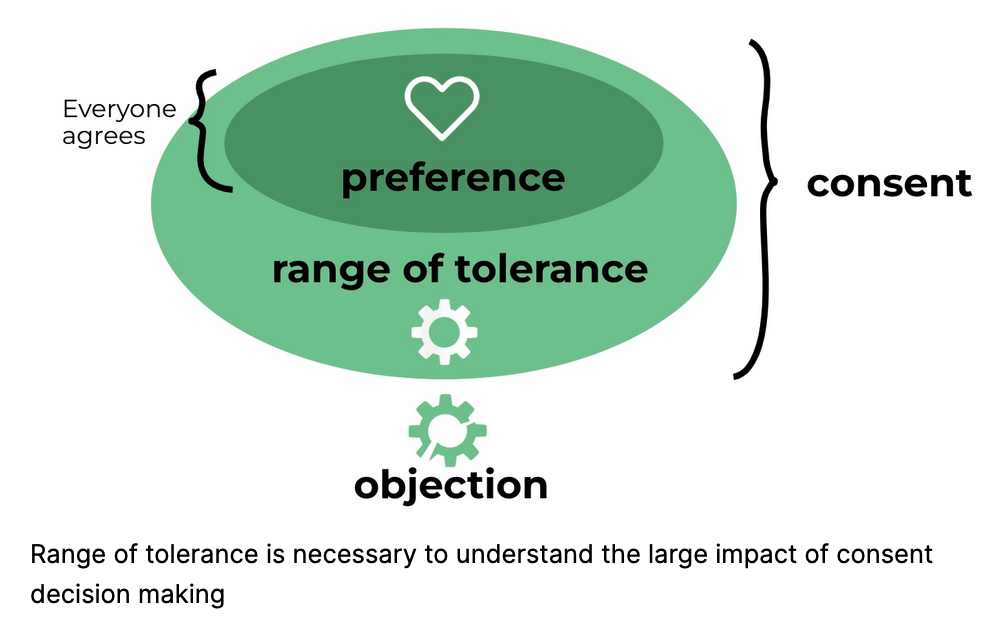

# Governance

This document defines the roles, responsibilities, and decision-making processes
for the UC OSPO Network ORB Team.

Our mission is to efficiently and equitably build tools that enhance the
discoverability of UC open source projects, in order to celebrate open source
creators and encourage community engagement with UC tools.

# Table of Contents

- [I. Guiding Principles](#guiding-principles)
- [II. Relevant Groups](#relevant-groups)
  - Community
  - Stakeholders
  - Working group (WG)
- [III. Voting](#voting)
- [IV. Decision-making Procedures](#decision-making-procedures)
  - Low-Stakes Proposals
  - High-Stakes Proposals
  - High-stakes Decision Timeline
  - Integration Meeting Procedure
- [V. Amendment](#amendment)

# I. Guiding Principles

**Low barrier to entry:** The ORB’s decision-making body (the Working Group) is
open to all stakeholders, (see [Section II](#relevant-groups)) recognizing that
our group is stronger when its members come from a diversity of backgrounds and
experience levels.

**Respect for objections:** This governance procedure is designed to surface
“impossible asks” that jeopardize our mission, clash with funder obligations, or
place undue burden on program implementers. In this way, it encourages group
members to recognize one another’s limitations and set realistic goals.

**Embrace of Risk:** By seeking “consent over consensus”, we embrace
experimentation and rapid iteration over the quest for perfection.

# II. Relevant Groups

Below we define the groups involved in the project, for the purposes of
decision-making.

**Community**: Anyone interested in the ORB, such as people in the OSPO network,
people on our Slack, colleagues at other universities, or members of the public
who join ORB community meetings.

**Stakeholders**: Stakeholders belong to at least one of these groups:

- They are affected by the ORB project
- They are funding the ORB project
- They are implementing the ORB project

**Working group (WG)**: Current WG members are listed in
[MEMBERS.md](./MEMBERS.md).

New WG members are initially “provisional members” and do not have voting
rights. They may raise objections, but those objections will not block proposal
approval unless the proposer chooses to recognize them. Once the provisional
member has attended two WG meetings (Integration meetings count towards this
requirement), then a Majority-rule vote is held to determine whether the
provisional member should be added to the WG. A ⅔ quorum is needed for the vote,
and a ¾ “yes” is required for the new member to join. Once membership is
approved, the new member is promoted to “full member” and they have voting
rights.

Active WG members must meet the following criteria:

- They must be a stakeholder
- They must attend most WG meetings (i.e., they are present more often than not)
- They must adhere to the [Code of Conduct](./CODE_OF_CONDUCT.md)

WG members who no longer meet the above criteria may be removed by Majority-rule
vote. A ⅔ quorum is needed for the vote, and a ¾ “yes” is required for the
member to be removed.

# III. Voting

In this document, we refer to two types of voting. The first is “Safe-to-try
Voting”. Safe-to-try voting is based on consent, as outlined by Sociocracy and
similar systems. Consent means "good enough for now, safe enough to try".
Consent does NOT mean that the consenter likes the proposal. It merely means
that they did not produce a reasoned, paramount objection.

Consent indicates tolerance, but not necessarily preference.
[https://www.sociocracyforall.org/consent-decision-making/](https://www.sociocracyforall.org/consent-decision-making/)

In a Safe-to-try Vote, the proposer or facilitator asks all members of the
voting body whether they have an objection to the present proposal. A "no" vote,
also known as an objection, indicates that the objector feels the proposal may
impede the group’s mission or cause irreparable harm. Objections might start
with, “This may impede our mission because…” The group follows a pre-determined
procedure based on the presence or absence of objections.

In a Majority-rule Vote, all members of the voting body cast a "yes" or "no"
vote. The votes are then counted and the outcome that received the most votes is
accepted. For the purposes of this document, all Majority-rule votes require a ⅔
quorum to be valid, and are administered by a volunteer from the WG.
Majority-rule votes concerning WG membership require ¾ “yes” votes to pass.

The term “voting” by itself refers to both types of voting.

# IV. Decision-making Procedures

We recognize two types of decision: low-stakes (won't destroy the project or
cause irreparable harm) and high-stakes (might destroy the project or cause
irreparable harm). Low-stakes decisions should be made quickly with limited
input. High-stakes decisions require a more formal and inclusive process. The
proposer determines the stake level. However, as described below, any member of
the WG may escalate a 'Low-Stakes' proposal to a 'High-Stakes' proposal through
an objection.

## Low-Stakes Proposals

Low-stakes decisions are, by default, resolved through lazy consensus. Proposers
may solicit feedback from the community prior to proposing a decision, but they
are not required to.

### Low-Stakes Decision Method: Lazy Consensus

- A member of the WG proposes a decision to the WG via Slack AND email. The
  proposal must clearly state that it is a low-stakes decision and: “This
  decision will be finalized in three business days unless a reasoned, paramount
  objection is raised.”
- If no outstanding objection remains by the end of the three-day window, the
  decision is adopted.
- An objection must state a clear technical or mission-critical rationale for
  blocking. Personal preference is insufficient.
- If at any point an objector fails to respond to the proposer for three
  consecutive business days, they forfeit their objection. The proposer may take
  longer to respond.

Most objections will likely be easily resolvable. If an objection has been
raised that cannot be resolved promptly, the decision will be escalated to the
high-stakes process below.

## High-Stakes Proposals

For high stakes decisions or low-stakes decisions for which there is
irreconcilable disagreement, we use a time-bound resolution process to achieve
consent in a timely manner.

### High-stakes Decision Timeline

The heart of the high-stakes decision-making procedure is the timeline. The
proposer is responsible for shepherding the group through this procedure
according to the timeline. If desired, and if they can find a WG member who is
willing, the proposer may designate a WG member to act as a facilitator to
administer this process and/or facilitate the Integration Meeting.

Deviation from the timeline is strongly discouraged, but this is ultimately left
to the discretion of the proposer. Unless the proposer determines otherwise,
from the time a formal proposal is introduced, a final decision MUST be reached
within 15 business days. Failure by one or more WG members to participate will
not delay the timeline.

#### 0. Socialization (Minimum 5 business days)

Before a formal proposal is introduced, the proposer must share a “Draft for
Socialization” via Slack and email for at least 5 business days. All members of
the WG are strongly encouraged to provide feedback, allowing the proposer to
mature the document before the 15-day clock begins.

During the socialization phase, the proposer is not required to collect feedback
in a transparent manner (e.g., via a collaborative document). However, they may
do so if they wish.

During this time, the proposer schedules an Integration Meeting. The proposer
must make a good-faith effort to schedule a time when all WG members can attend.
If desired, the proposer can use the lazy consensus method to propose using a WG
meeting slot to conduct an Integration Meeting. Three (“full”, i.e. voting) WG
members are considered a quorum, and thus an Integration Meeting attended by
three WG members is sufficient to proceed.

#### 1. First Review Period (Days 1-4)

The 15-day clock begins only once:

- 5 business days of socialization have elapsed
- A mature high-stakes proposal has been sent to the group
- An Integration Meeting has been scheduled

The proposer shares the formal proposal via Slack and email, explicitly marking
it as a “High-Stakes Proposal.” The proposer makes the proposal available for
review using technology that is accessible to all WG members and that allows WG
members to view each others’ comments.

WG members review the proposal asynchronously. Concerns, questions, and
suggestions are collected via the shared document.

During this time, the proposer amends the proposal based on the feedback. The
editing process need not be visible to the group, but the changes should be
tracked\* and recorded, and these changes should be made available when the
amended proposal is made available.

\*A changelog summarizing major changes is sufficient, though versioning is
strongly encouraged.

The proposer must share the amended proposal (and changes) with the group at
least 24 hours before the Integration Meeting.

#### 3. Integration Meeting (Between days 5 and 7)

The proposer presents the amended proposal at the Integration Meeting. The
format of the Integration Meeting is described in a separate section below.

At the end of the Integration Meeting, a final Safe-to-try Vote is conducted on
whether to proceed with casual review or standard review.

**Casual review:** an amended proposal is circulated following the “lazy
consensus” procedure. It is not necessary to collect asynchronous feedback in a
transparent manner (e.g., a shared collaborative document). This is intended to
save the proposer time and incentivize attendance at the Integration Meeting.

**Standard review:** an amended proposal is circulated following the same
procedure as the first review period.

To proceed with casual review, all WG members present at the Integration Meeting
must consent to casual review.

#### 4. Second Review Period (Days 8-11)

An amended proposal is circulated, and a second review is conducted via the
process that was decided at the Integration Meeting.

#### 5. Decision vote (Days 12-15)

The proposer circulates a final amended proposal based on feedback from the
second review period. This communication MUST include a summary of major changes
since the first version of the proposal. The proposer makes clear in this
communication the date and time of the deadline for the final vote.

Members have three business days to respond with one of yes, no, or abstain.
Abstention counts toward the quorum, but is not counted when tallying votes.

The process defaults to Majority-Rule Vote as a last resort. The proposer
tallies the “Consents” vs “Objections.” If “Consents” are the majority, the
proposal passes despite the objection. If the number of “Consents” and
“Objections” is tied, then the decision is made by a coin flip.

### Integration Meeting Procedure

Below is the format of the Integration Meeting. This format is intended to
expedite review, surface strong reactions, and provide space for creative
revisions.

**Phase 1:** Understand the proposal

- Summary: The proposal is presented to the group. Revisions since version 1 are
  explained.
- Clarification: The group has the opportunity to ask clarifying questions.

**Phase 2:** Explore reactions

- Quick reactions: Everyone gets a chance to give their opinion on the proposal.
  This works best if every contribution is brief – five sentences or less.

**Phase 3:** Brainstorm amendments

- Suggestions: Anyone in the group may propose one or more amendments to address
  concerns and make the proposal “safe to try”. Some examples include:
  - Reducing the scope of the proposal to make it more realistically achievable
  - Adding collaborators, or crafting a plan for recruiting collaborators
  - Shortening the duration or adding an end date
  - Adding regular progress reports or review meetings
  - Collecting data to monitor a particular concern
  - Clarifying and/or modifying the proposal’s definition of success

**Phase 4:** Amend the proposal

- Amendment: The proposer takes five to fifteen minutes to consider the group’s
  feedback and quickly sketch a plan for addressing their concerns.

**Return to Phase 1.** Repeat the iterative process as many times as the meeting
duration allows.

**Phase 5:** Safe-to-try Vote on final review process

- Vote: The group conducts a Safe-to-try Vote to determine whether the second
  review will be Casual or Standard.

The decision made in Phase 5 is final and may not be reopened unless there is a
major change in circumstances. If a WG member would like to present a new
proposal regarding an old issue, that person has an obligation to demonstrate
that either new circumstances warrant re-review, or their proposal presents a
novel idea that the group has never considered. The group may decline reopening
the decision process by Majority-rule vote.

# VII. Amendment

The procedures in this governance document may be amended by the High Stakes
Proposal Process. Minor changes to language may be amended by the Low Stakes
Proposal Process. Typos do not require a formal process.
